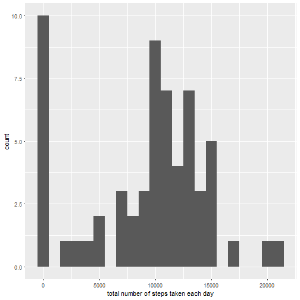

# Reproducible Research: Peer Assessment 1

## Loading and preprocessing the data

```r
activitydata <- read.csv("activity.csv")
activitydata$date <- as.POSIXct(activitydata$date, format="%Y-%m-%d")
```

## What is mean total number of steps taken per day?
Histogram of steps per day

```r
library(ggplot2)
steps.day <- tapply(activitydata$steps, activitydata$date, FUN=sum, na.rm=TRUE)
qplot(steps.day, binwidth=1000, xlab="# of steps per day", ylab="Frequency")
```



Mean steps per day

```r
mean(steps.day, na.rm=TRUE)
```

```
## [1] 9354.23
```

Median steps per day

```r
median(steps.day, na.rm=TRUE)
```

```
## [1] 10395
```

## What is the average daily activity pattern?
Time series plot of 5-minute interval and average steps

```r
library(ggplot2)
avg.daily <- aggregate(x=list(steps=activitydata$steps), by=list(interval=activitydata$interval),
                      FUN=mean, na.rm=TRUE)
ggplot(data=avg.daily, aes(x=interval, y=steps)) +
    geom_line() +
    xlab("5-minute Interval") +
    ylab("Daily average # of steps")
```


Which 5-minute interval contains the maximum number of steps?

```r
avg.daily[which.max(avg.daily$steps),]
```

```
##     interval    steps
## 104      835 206.1698
```

## Imputing missing values

Total number of rows with missing values

```r
sum(is.na(activitydata$steps))
```

```
## [1] 2304
```

Fill strategy: replace NAs with Mean for respective day

```r
replace.NA <- function(steps, interval) {
    value <- NA
    if (!is.na(steps))
        value <- c(steps)
    else
        value <- (avg.daily[avg.daily$interval==interval, "steps"])
    return(value)
}
imp.activitydata <- activitydata
imp.activitydata$steps <- mapply(replace.NA, imp.activitydata$steps, imp.activitydata$interval)
```

Histogram of steps per day using imputed data set


```r
imp.avg.daily <- tapply(imp.activitydata$steps, imp.activitydata$date, FUN=sum)
qplot(imp.avg.daily, binwidth=1000, xlab="# of steps per day", ylab="Frequency")
```


Mean steps per day with imputed data set

```r
mean(imp.avg.daily, na.rm=TRUE)
```

```
## [1] 10766.19
```

Median steps per day with imputed data set

```r
median(imp.avg.daily, na.rm=TRUE)
```

```
## [1] 10766.19
```

Both the mean and median increased significantly with the imputed data set. This is the result of replacing steps with NA values for intervals with daily means; these records were originally treated as 0 steps.

## Are there differences in activity patterns between weekdays and weekends?

Create new data with weekday and weekend levels

```r
week.activitydata <- data.frame(date=imp.activitydata$date, 
                            weekday=tolower(weekdays(imp.activitydata$date)), 
                            steps=imp.activitydata$steps, 
                            interval=imp.activitydata$interval)
week.activitydata <- cbind(week.activitydata, 
                      daytype=ifelse(week.activitydata$weekday == "saturday" | 
                                             week.activitydata$weekday == "sunday", "weekend", 
                                     "weekday"))

week.activitydata <- data.frame(date=week.activitydata$date, 
                       weekday=week.activitydata$weekday, 
                       daytype=week.activitydata$daytype, 
                       interval=week.activitydata$interval,
                       steps=week.activitydata$steps)
```

Panel time series plot showing weekday and weekend average steps for each 5-minute interval

```r
library(lattice)
panel.data <- aggregate(x=list(steps=week.activitydata$steps),by=list(daytype=week.activitydata$daytype, weekday=week.activitydata$weekday,interval=week.activitydata$interval), mean)

xyplot(steps ~ interval | daytype, panel.data, 
       type="l", 
       lwd=1, 
       xlab="Interval", 
       ylab="Average # of steps", 
       layout=c(1,2))
```


