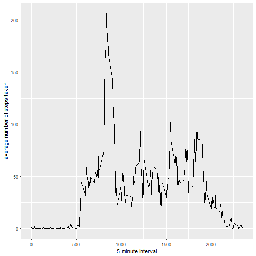
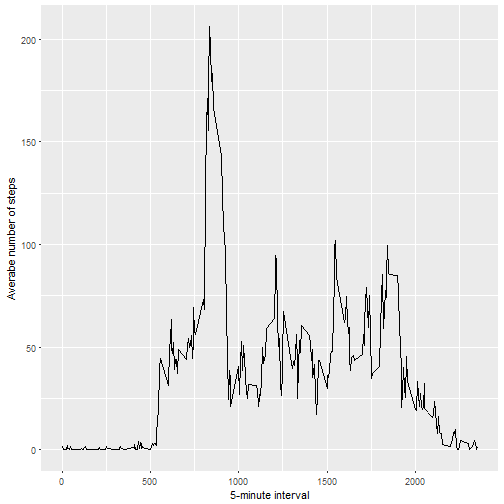

# Reproducible Research: Project 1

## Loading and preprocessing the data


```r
unzip(zipfile = "activity.zip")
```

```
## Warning in unzip(zipfile = "activity.zip"): error 1 in extracting from zip
## file
```

```r
activitydata <- read.csv("activity.csv")
activitydata$interval <- strptime(gsub("([0-9]{1,2})([0-9]{2})", "\\1:\\2", activitydata$interval), format='%H:%M')
```


## 1. What is mean total number of steps taken per day?


```r
library(ggplot2)
dailysteps <- tapply(activitydata$steps, activitydata$date, FUN = sum, na.rm = TRUE)
qplot(dailysteps, binwidth = 1000, xlab = "Number of steps per day", ylab="Number of days")
```




```r
dailymean <- mean(dailysteps, na.rm = TRUE)
dailymedian <- median(dailysteps, na.rm = TRUE)
```

* Mean: ``9354.2295082``
* Median:  ``10395``


## 2. What is the average daily activity pattern?


```r
library(ggplot2)
dailyaverage <- aggregate(x = list(steps = activitydata$steps), by = list(interval = activitydata$interval), 
    FUN = mean, na.rm = TRUE)
```

```
## Error in complete.cases(by): invalid 'type' (list) of argument
```

```r
ggplot(data = dailyaverage, aes(x = interval, y = steps)) + geom_line() + xlab("5-minute interval") + 
    ylab("Averabe number of steps")
```




```r
moststepinterval <- dailyaverage[which.max(dailyaverage$steps), ]
```


* Most Steps at: ``835, 206.1698113``

## 3. Imputing missing values


```r
nummissing <- length(which(is.na(activitydata$steps)))
```

* Number of missing values: ``2304``


Fill Strategy: Use mean value for 5-minute interval.


```r
fill <- function(steps, interval) {
    filled <- NA
    if (!is.na(steps))
        filled <- c(steps)
    else
        filled <- (dailyaverage[dailyaverage$interval==interval, "steps"])
    return(filled)
}
imputeddailysteps <- activitydata
imputeddailysteps$steps <- mapply(fill, imputeddailysteps$steps, imputeddailysteps$interval)
```

```
## Error in dots[[2L]][[12L]]: subscript out of bounds
```
Histogram using updated data with imputed values


```r
qplot(imputeddailysteps, xlab='Steps per day (Imputed)', ylab='Frequency using binwidth 500', binwidth=1000)
```

```
## Don't know how to automatically pick scale for object of type data.frame. Defaulting to continuous.
```

```
## Error: stat_bin requires the following missing aesthetics: x
```


```r
meanimputed <- mean(imputeddailysteps)
medianimputed <- median(imputeddailysteps)
```

* Mean (Imputed): ``1.0766189 &times; 10<sup>4</sup>``
* Median (Imputed):  ``1.0766189 &times; 10<sup>4</sup>``


## 4. Are there differences in activity patterns between weekdays and weekends?


```r
imputeddailysteps$day.type <-  ifelse(as.POSIXlt(imputeddailysteps$date)$wday %in% c(0,6), 'weekend', 'weekday')
```


```r
avgimputeddailysteps <- aggregate(steps ~ interval + dateType, data=imputeddailysteps, mean)
```

```
## Error in eval(predvars, data, env): object 'dateType' not found
```

```r
ggplot(avgimputeddailysteps, aes(interval, steps)) + 
    geom_line() + 
    facet_grid(day.type ~ .) +
    xlab("5-minute interval") + 
    ylab("Avarage number of steps")
```

```
## Error in ggplot(avgimputeddailysteps, aes(interval, steps)): object 'avgimputeddailysteps' not found
```
